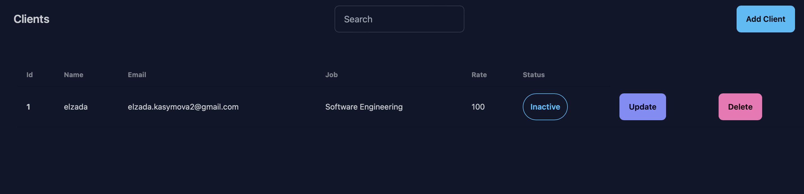

CRUD Application with React, Express, and Prisma

This project is a full-stack CRUD (Create, Read, Update, Delete) application. The frontend is built using React and Vite, and the backend is built with Express and Prisma ORM, utilizing a PostgreSQL database.

## Project Structure

### Frontend (crud-frontend)
This folder contains the client-side application built with React, Vite, and TailwindCSS.

```
crud-frontend
├── /src
    └── /components
            ├── ModalForm.jsx       # Form modal for adding and editing client data
            ├── NavBar.jsx          # Navigation bar with search functionality
            └── TableList.jsx       # Displays a list of clients in a table format
    └── App.css                    # Styles for the main application
    └── App.jsx                     # Main application component that manages state and API calls
    └── index.css                   # Global styles
    └── main.jsx                    # Entry point for the React application
├── package.json                   # Defines dependencies and scripts for the React app
```

### Backend (crud-backend)
```
crud-backend
├── /src
    ├── /prisma
    ├── /controllers
    │    └── clientController.js   # Handles client-related actions like create, update, and delete
    ├── /routes
    │    └── clientRoutes.js       # Defines API routes for client CRUD operations
    ├── /services
    │    └── clientService.js      # Contains logic to interact with the database (via Prisma ORM)
    ├── .env                        # Stores environment variables such as database credentials
    └── index.js                    # Main entry point for the server; configures middleware and routes
├── package.json                   # Defines dependencies and scripts for the backend
```

## Features

### Frontend Features
- **Search Functionality**: The ability to search through clients by name, email, or job.
- **Add/Edit Client**: Modal forms for adding or editing clients.
- **Delete Client**: Option to delete clients from the table.
- **Responsive UI**: The layout adjusts based on screen size using TailwindCSS.

### Backend Features
- **API Routes**: Implements API routes for managing client data:
  - `GET /api/clients` - Fetches all clients.
  - `POST /api/clients` - Adds a new client.
  - `PUT /api/clients/:id` - Updates an existing client.
  - `DELETE /api/clients/:id` - Deletes a client by ID.
  - `GET /api/clients/search` - Searches for clients based on a search term.
- **Prisma ORM**: Used to interact with a PostgreSQL database for storing and managing client data.

## Installation

### 1. Clone the repository
```bash
git clone <https://github.com/Elzada-Kasymova/full-stack-CRUD-.git>
```

### 2. Set up the database
Create a `.env` file in the `crud-backend` folder and add the following environment variables:
```bash
PORT=8383
POSTGRES_USER=user
POSTGRES_PASSWORD=password
POSTGRES_DB=mydb
DATABASE_URL="postgresql://user:password@db:5432/mydb?schema=public&pgbouncer=true"
```

### 3. Run Docker
```bash
docker-compose up -d
```

### 4. Enter the backend container
```bash
docker exec -it full-stack-app-backend-1 bash
```

### 5. Run Prisma migrations
```bash
npx prisma migrate deploy
```

## Usage
After completing the setup, the application is ready to use. Simply navigate to:

[http://localhost:5173](http://localhost:5173)

## Technologies Used
- **Frontend**: React, Vite, TailwindCSS, Axios
- **Backend**: Express, Prisma, PostgreSQL
- **Database**: PostgreSQL
- **ORM**: Prisma

## How It Looks



